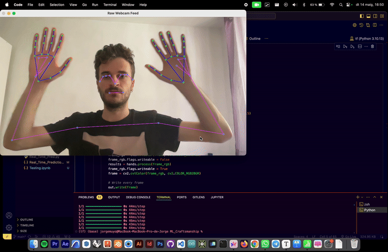
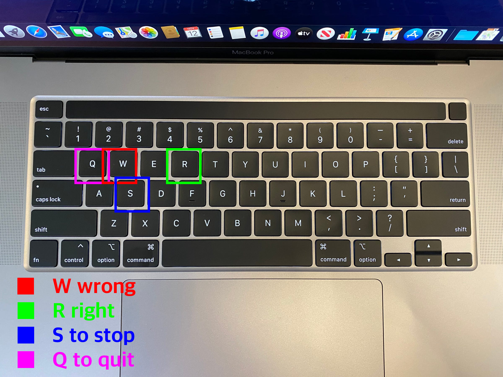
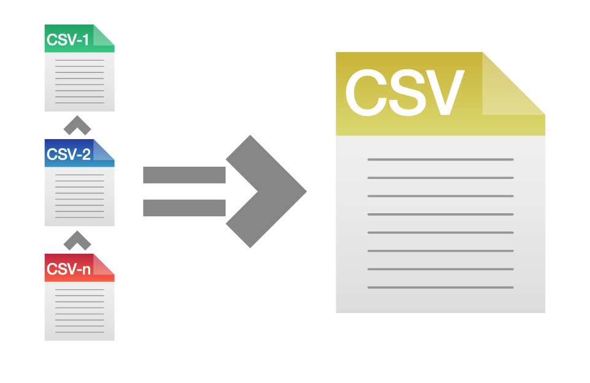
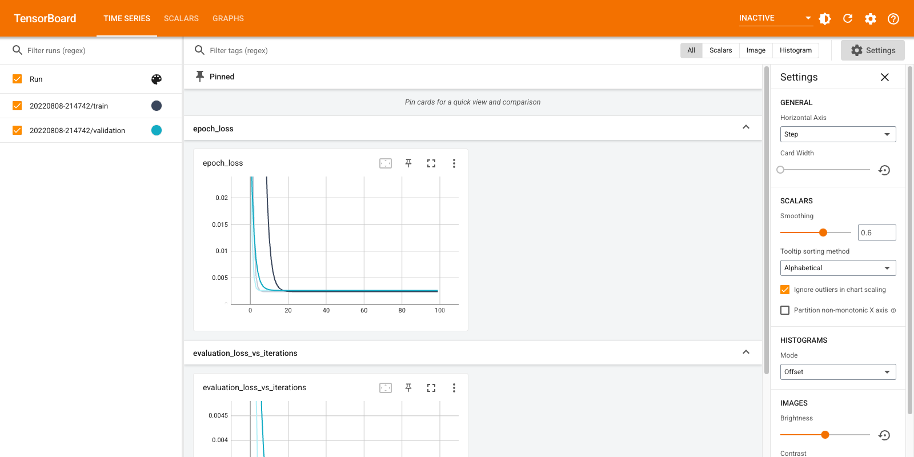

#  Machine Learning for Action Detection

#### [Jorge Muñoz Zanón](https://jmuozan.github.io/mdef-website/)

As part of my thesis project on Future Learning focused on Arts and Crafts I decided to prototype for third MicroChallenge a machine learning model that can learn certain actions and tell you when you're doing them right or wrong. With a live camera prediction you'll be able to know if the movement is being done in the correct way.

## Overview

The project involves creating a machine learning model capable of detecting specific actions via a live camera feed. The goal is to provide real-time feedback on whether the actions are performed correctly or incorrectly, with applications in arts and crafts.

The system uses a live camera to capture movements. By leveraging MediaPipe for landmark detection and a trained machine learning model, the program evaluates the accuracy of the movements in real-time, displaying feedback directly on the screen.

## Propose 

The system is designed to:

- Provide real-time feedback on the correctness of performed actions.

- Enhance learning experiences in arts and crafts by identifying right and wrong movements.

It is not intended for:

- Situations where high-stakes precision is required.

## Planing

The steps followed during the MicroChallenge week were the following:

1. Conceptualizing the project idea.

2. Collecting and processing data.

3. Training the machine learning model.
4. Debugging the code
5. Implementing real-time prediction using a Python script.
6. Iterating on design and functionality based on test results.

##  What files are available on the repo?

In this repository you'll find:

- `ML_Sequence_Recognition.ipynb` a Jupyter notebook with all the steps since the data collection and treatment to the training and real-time predictions
- `Real_Time_Pred.py` a python file with just the predictions in real time, in case you just want to test how it works
- `actions.h5` the model already trained
- `IMG` folder, with the images for this documentation
- `CSVs` for you to see how the data will look like during it's collection and treatment

## What you'll need

**Software**: Python, TensorFlow, OpenCV, MediaPipe.

- **MediaPipe** for detecting body landmarks.

- **OpenCV** for video capture and display.

- **TensorFlow** for training the machine learning model.

- **Python** or **Jupyter installed.

This technology is used meaningfully by:

- Utilizing MediaPipe’s robust landmark detection to ensure accurate data collection.

- Applying TensorFlow for creating a responsive and adaptable machine learning model.

- Integrating these tools in a straightforward Python script to maximize accessibility and ease of use.

**Hardware**: Standard computer with webcam. (If possible, an Nvidia GPU or Apple silicon for hardware acceleration although not necessary)

## References

If you want to use ML to predict sequences but this structure doesn't fit to you I highly recommend to check the following tutorials where I've been inspired:

- [Nicholas Renotte: Sign Language Detection using ACTION RECOGNITION with Python | LSTM Deep Learning Model](https://www.youtube.com/watch?v=doDUihpj6ro&list=PLtjLv8XIYA2GPl5Pju2eebqfV9oOlB675&index=4)
- [Nicholas Renotte: AI Learns to Do Deadlifts](https://www.youtube.com/watch?v=H7cGq0xIHbc&list=PLtjLv8XIYA2GPl5Pju2eebqfV9oOlB675)
- [Nicholas Renotte: Training my deadlift bot with MediaPipe and OpenCV](https://www.youtube.com/watch?v=PGsAsuwBdw0&list=PLtjLv8XIYA2GPl5Pju2eebqfV9oOlB675&index=2)

## How does it work?

In this part I'm going to walk you through the different steps followed by my code. Also I will try to explain what errors you might get while trying to execute the code and how to solve them. (Also, if you find any error that is not solved here don't doubt on contacting me so I can update the documentation)

### 1st step: Get your data

Before starting, the first thing to do is to install and import the used dependencies. The first two blocks of the code will do that. We will mediapipe to detect all the points on our hands and body, Opencv to access the camera or video and pandas, numpy and matplotlib to prepare our data. Later we will install our dependencies for the training.

After installing and importing, if our goal is to be able to detect sequences the follow up part will be to know where to extract them from. For that you'll need a video. I highly recommend a high quality video where the light is good so the hands and body recognition will work best. If not the script is sited up for you to use your webcam, just as I did for the example of this repo.

The first big block of code (Cell 3) will make sure that your laptop can access your camera and draw the landmarks generated by mediapipe. The landmarks generated will be all the points detected in hands and body (Additionally you can also detect the points of your face, as I haven't made use of them here I haven't included them but if you're interested I recommend you to check on the mediapipe documentation). Once you test that the camera is working press `q` to exit the video.

***NOTE:** A common error will be that executing the cell gives you an error or opens up a camera you don't want to use, if this happens try to change the number on `cap = cv2.VideoCapture(0)` as depending on the cameras set up on your computer the number will be different. (On my MacBook number `0` corresponds to my webcam)



Next up you'll record your video on Cell 4. If you have your video already recorded go straight to the next Cell. Cell 4 will be similar to cell 3 but this one won't show the landmarks of mediapipe. Here you will need to do the movements you want to capture. In other to use them for machine learning you will have to repeat them a bunch of times in the right and wrong way (In my test I captured two different movements and inside of each I captured around 30 times each way(right and wrong)). If you want to detect more than one movement right and wrong I will recommend to re-execute the cell and save different videos for different movements so that way can be more organized, even though it will work fine if it's just with one video.

Here's and schematic of how I recommend to do the video capturing so it will be easier to work with that later:


Great! Now that the videos are recorded it's time to capture our data. This is where the structure of recording I mentioned earlier comes useful. First off we will create our `.csv` to store our data. By executing the cell a file will be created that when opened with any spreadsheet program will look like this:


`class` will represent the movement, `accuracy` will represent if it's right or wrong and `sequence` will represent the sequence of frames were those points were captured. The rest of columns are the individual values of each point of the body (x, y, z), right hand and left hand. The value `v` represents the visibility captured by mediapipe, here I'm capturing it because if for your application you only need to detect the body can be useful, if you want to detect hands (as in this case) it won't be that useful because the hands cannot capture visibility. That's why once it's filled on the hands you'll always get a 0. As the hands don't get visibility values if they're not detected on screen they won't output any value. For that reason, I modified the capture code to always output a value, even if it's a 0, this will help us have the same amount of points always.

Next cell will open up the video recorded `cap = cv2.VideoCapture('your_video.your_extension')` and will play it rendering the different landmarks and connections. Before executing we will assign the correct label to the movement of the video. For that, you'll go to the end of the cell and change the string:

```python
df = pd.read_csv('coordinates_1.csv')
df.loc[df['accuracy'].notna(), 'class'] = 'your_label'
df.to_csv('coordinates_1.csv', index=False)
```

Once recording you'll have to be quick with your keyboard!!! If the movement seen on screen is right you'll have to press `r` and it will automatically capture all the points for each frame until you press `s` to stop, same with wrong movements you'll press `w` to capture the point for the amount of frames desired. To quit the capture, press `q`. Here's a quick keyboard map:



Do that for every video you have and get all the different movements mapped. Once that's done if you open the `.csv` you'll get the following structure:


After capturing all the information for each movement (in case you did it my way) you'll end up having a bunch of different `.csv` files (coordinates_1, coordinates_2... , coordinates_n). If you open all of them you'll see that each one is labeled as the image above but only the first has headers. If this is correct we can move on to the second step. (Please check your files to see that you have the labels and you don't have null values because it will affect the process later)

### 2nd step: Process data

The goal of this step is to get our data ready for machine learning. We are dealing with a lot of different data that can have a lot of errors if the detection doesn't work so well so we need to reshape this data in a way that the model can easily understand it, for that reason we will try to split all the data by frames, sequences and movements and then rejoined again. Might look like it doesn't make sense but I found out that working with `.csv` is easier for me. This two steps can be reconfigured in a better way.

Before splitting all the data by sequences and labels we will join the data files in one big file were we will take out the not important data and merge the labeling. Cell 8 will join all our different `.csv` into one file. Don't forget to add as many data frames as you need and add them to `combined_df` 

```python
df1 = pd.read_csv('coordinates_1.csv', header=None)
df2 = pd.read_csv('coordinates_2.csv', header=None)
....
```

Once all of them are joined on `combined_coordinates.csv` we will first `.drop` all the visibility columns on Cell 9 (as I mentioned earlier I'm also detecting hands that don't have visibility values so they're not useful in this case. If you just want to detect body maybe they can be useful), and on Cell 10 we will merge the first to labeling columns `class` and `accuracy` into `label` this will help the array that we will create later have 1 dimension to machine learn it. This block of code will transform the `accuracy` column 0s and 1s into Ws and Rs and will merge them with the information on `class` after this, it will drop the columns. 


Once that's done we will check that the amount of points captured corresponds to the rows of the array-2 (2 being the labeling columns) to know the amount of point necessary we will multiply the amount of point for each detection*3. 


Following up, on Cell 12 we will take out the unique labels of the modified `.csv` and we will assign them to a string for later.

After this, Cell 13 and Cell 14 will create the data base directory with folders and will split all the `.csv` file and will split all the movements, sequences and frames and save them in the respective folders in an flatten numpy array.


Next up from Cell 16 to 17 the code will count the number of sequence folder per movement and per sequence and will equalize all the folders, creating new ones, then it will create new `np.zeros` arrays to make every movement have the same amount of sequences and the same amount of frames, even if they are full of zeros. This will allow to do the training. 

***NOTE:** Be aware to assign the correct data type to the new created arrays `zero_array = np.zeros(225, dtype=np.float32)` as Tensorflow (the library we will use for training) does not support `float.64` 

The last part of this step will be creating a label map to map numbers into our labels list so they can be trained, and assign this label map and sequence to the np arrays joining all of them into one big array.

## 3rd step: GPU set up

All the code in this step (from Cell 22 to 24) is based on the code made by [**fotiecodes**](*https://blog.fotiecodes.com/install-tensorflow-on-your-mac-m1m2m3-with-gpu-support-clqs92bzl000308l8a3i35479*) to set up and make sure that you GPU is working for the training part. This code will only be useful if you use a Macbook with apple silicon (M1, M2, M3...) if you're not this code won't work for you. If you're using and Nvidia GPU you can also set up your GPU to speed up the training. Please refer to [Tensorflow documentation](https://www.tensorflow.org/guide/gpu).

## 4th step: Training

In this part we will divide our big array again into 4 different variables. The first split will be to divide the labels from the points. These values we will assign to y and X. After this in order to train the model we will divide again X and y into X_train, X_test, y_train and y_test. This will be the different values used by the model to train itself and then test its results. After this, on Cell 29, Logs is set up, this will help keep track of the training in real time, we will be able to check how the training it's going. To do it, once the training is going you can go to the terminal `cd. your_directory` and write the following command `tensorboard --logdir=.` 



After that, in the following part, we will set up our neural network, which I didn't set up myself in this code as I haven't checked well the documentation of Tensorflow. The one in the code is optimized by Chat-GPT4. It did a really good job as the ones from tutorials I was setting up were super slow while training. I recommend to fully read the documentation (As I will do) to optimize it to its maximum. Lastly, we will compile the model and run it with `model.fit`. 

### 5th step: Tests

After training, we can save our `.h5` file which will be the weights used in the network and we will be able to use them in any other script. In this part we set up some predictions and compare them to the results of the actual array to see the accuracy of the model in real tests.

### 6th step: Metrics

This part of the code just imports the multi label confusion matrix and applies it to our model to see how well it preformed. If you want to know more about the `multilable_confusion_matrix` you can check it's documentation [**here**](https://scikit-learn.org/stable/modules/generated/sklearn.metrics.multilabel_confusion_matrix.html)

## 7th step: Finally!!!!! Some real time testing

This last block of code which still is in progress, lets you test the model in real time with your camera opened. I'm still working on it's interface but for now on the upper-left corner it will tell you which action are you doing, if it's wrong the text and landmarks rendered on your body will be in red and if it's right they will be in green.


## Trial and error
Coming from a background in Industrial Design Engineering, transitioning to coding was incredibly challenging for me as I initially lacked computational thinking skills. Despite this, I managed to overcome the difficulties and am proud of the results. 

The journey of learning and applying coding skills was integral to the success of this project, and I am confident that with further experience, I will continue to enhance and expand these capabilities.

## Conclusions

The model doesn’t have the best accuracy, but it partially works, providing valuable insights into the potential of using machine learning for action detection in arts and crafts. This initial test has shown me that significantly more sample data will be needed to improve the model’s performance. When I collaborate with artisans and gather a larger dataset, I believe the system’s accuracy will improve.

I am excited about the prospect of testing the model in real-world scenarios with different arts and crafts, where it can provide real-time feedback to practitioners. This project has been a significant learning experience, and despite its current limitations, I am proud of what has been achieved so far. It lays a strong foundation for future development and refinement.

Thank you for reading until here! I am eager to continue this journey and explore how machine learning can enhance the practice and teaching of arts and crafts. <3

Feel free to ask for any further detail or clarification on any of the sections.

### Real time predictions python code

```python
import cv2
import numpy as np
import mediapipe as mp
from tensorflow.keras.models import load_model

mp_holistic = mp.solutions.holistic
mp_drawing = mp.solutions.drawing_utils

model_path = 'actions.h5'
model = load_model(model_path)

reverse_label_map = {value: key for key, value in label_map.items()}
def mediapipe_detection(image, model):
    image = cv2.cvtColor(image, cv2.COLOR_BGR2RGB)
    image.flags.writeable = False
    results = model.process(image)
    image.flags.writeable = True
    image = cv2.cvtColor(image, cv2.COLOR_RGB2BGR)
    return image, results

def draw_styled_landmarks(image, results):
    if results.pose_landmarks:
        mp_drawing.draw_landmarks(
            image, results.pose_landmarks, mp_holistic.POSE_CONNECTIONS,
            mp_drawing.DrawingSpec(color=(80,22,10), thickness=2, circle_radius=4),
            mp_drawing.DrawingSpec(color=(80,44,121), thickness=2, circle_radius=2)
        )
    if results.left_hand_landmarks:
        mp_drawing.draw_landmarks(
            image, results.left_hand_landmarks, mp_holistic.HAND_CONNECTIONS,
            mp_drawing.DrawingSpec(color=(121,22,76), thickness=2, circle_radius=4),
            mp_drawing.DrawingSpec(color=(121,44,250), thickness=2, circle_radius=2)
        )
    if results.right_hand_landmarks:
        mp_drawing.draw_landmarks(
            image, results.right_hand_landmarks, mp_holistic.HAND_CONNECTIONS,
            mp_drawing.DrawingSpec(color=(245,117,66), thickness=2, circle_radius=4),
            mp_drawing.DrawingSpec(color=(245,66,230), thickness=2, circle_radius=2)
        )

def extract_keypoints(results):
    pose = np.array([[res.x, res.y, res.z] for res in results.pose_landmarks.landmark]).flatten() if results.pose_landmarks else np.zeros(33*3)
    lh = np.array([[res.x, res.y, res.z] for res in results.left_hand_landmarks.landmark]).flatten() if results.left_hand_landmarks else np.zeros(21*3)
    rh = np.array([[res.x, res.y, res.z] for res in results.right_hand_landmarks.landmark]).flatten() if results.right_hand_landmarks else np.zeros(21*3)
    return np.concatenate([pose, lh, rh])

sequence = []
sentence = []
threshold = 0.5

cap = cv2.VideoCapture(0)
with mp_holistic.Holistic(min_detection_confidence=0.5, min_tracking_confidence=0.5) as holistic:
    while cap.isOpened():
        ret, frame = cap.read()
        if not ret:
            print("Error: Frame could not be read.")
            break

        frame = cv2.flip(frame, 1) 

        image, results = mediapipe_detection(frame, holistic)
        draw_styled_landmarks(image, results)

        if results.pose_landmarks or results.left_hand_landmarks or results.right_hand_landmarks:
            keypoints = extract_keypoints(results)
            sequence.append(keypoints)
            sequence = sequence[-30:]  # Keep the last 30 sequences

            if len(sequence) == 30:
                res = model.predict(np.expand_dims(sequence, axis=0))[0]
                action = actions[np.argmax(res)]
                if action.endswith("_W"):
                    color = (0, 0, 255)  
                elif action.endswith("_R"):
                    color = (0, 255, 0)  
                else:
                    color = (255, 255, 255)  

                # Display the predicted action on the screen
                cv2.putText(image, f'Action: {action}', (15, 50), cv2.FONT_HERSHEY_SIMPLEX, 1, color, 2, cv2.LINE_AA)

        cv2.imshow('OpenCV Feed', image)
        if cv2.waitKey(10) & 0xFF == ord('q'):
            break

    cap.release()
    cv2.destroyAllWindows()
```

### To-do Checklist

- [x] Initial idea
- [x] Interaction Description
- [x] Research references (Links, papers, videos....)
- [x] Propose (What is supposed to do or not to do)
- [x] Shown how your team planned and executed the project. (Explain personal contributions)
- [x] Integrated Design (How you designed it - relation between elements)
- [x] Honest Design (use of technology in a meaningful way, in relation to your interventions)
- [x] Explore design boundaries (based on your expertise)
- [x] Add names and links to your individual pages
- [x] Design process (How did you iterate)
- [x] How did you fabricate it (fabrication processes)
- [x] Digital system (illustration explaining function, parts, protocols)
- [x] Design & Fabrication files (open source or open format)
- [x] BOM (Build of Materials)
- [x] Reflect about future development opportunity
- [x] Described problems and how the team solved them
- [x] References and resources
- [x] Photograph’s of the end artefacts
- [x] Attendance to classes
- [x] Proactive behaviours to find answers during the challenge
- [x] Help others student’s projects
- [x] Participation in feedbacks
- [x] Explode
